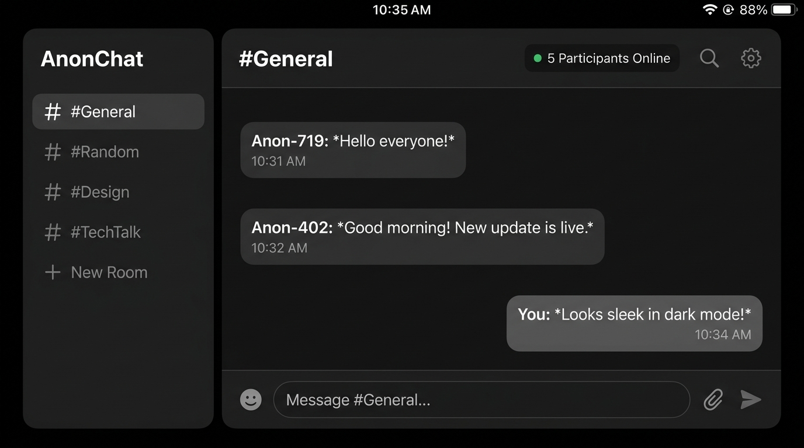

# AnonChat - Anonymous Multi-User Chat Application

> A minimalist, real-time, multi-user anonymous chat application built with **React**, **React Router**, **Tailwind CSS**, and **Firebase Realtime Database**.

---

## 📷 Preview & Screenshots



---

## ✨ Features

- **🔐 Anonymous Session Auth & Tab Persistence**:
  - Auto-assigns friendly, randomized aliases (e.g. `Anon-4821`).
  - Stores credentials strictly within `sessionStorage`. Closing the browser tab destroys the session, ensuring a fresh anonymous identity upon reopening.
  - Ability to generate a new anonymous identity on demand.

- **⚡ Real-Time Ephemeral Messaging**:
  - Subscribes to live room updates via Firebase Realtime Database.
  - Includes local multi-tab sync (`BroadcastChannel`) ensuring instant messaging across tabs even when testing offline.

- **⏳ 24-Hour Auto-Expiry Buffer**:
  - Filters out any messages older than 24 hours (`timestamp < Date.now() - 86400000`).
  - Guarantees true ephemerality without permanent log accumulation.

- **👥 Live Room Presence Counter**:
  - Real-time online participant tracking in the room header (e.g. `• 3 people in room`).
  - Automatic presence cleanup via Firebase `onDisconnect()` listeners.

- **🛡️ English Profanity & Abuse Filter**:
  - Client-side sanitization restricting abusive, profane, or toxic words in English.
  - Automatically masks restricted words with asterisks prior to storage or broadcast.

- **🖤 Sober & Rounded Dark Aesthetic**:
  - Pure black (`#000000`) theme with neutral grey accents (`zinc-900`/`zinc-800`).
  - Clean `rounded-2xl` message bubbles and `rounded-full` input bar without flashy icons or unnecessary distractions.

- **📱 Fully Responsive Layout**:
  - Collapsible overlay drawer navigation for mobile screens (< 768px).
  - Fixed left sidebar navigation for desktop screens.

- **💬 Pre-configured Public Rooms**:
  - `#General`
  - `#Confessions`
  - `#Advice`
  - `#Random`
  - `#Tech-Talk`

---

## 🛠️ Tech Stack

- **Frontend**: React 19, React Router v7
- **Styling**: Tailwind CSS v4, Vanilla CSS
- **Backend / Database**: Firebase Realtime Database & Firebase Anonymous Authentication
- **Build Tool**: Vite

---

## 🚀 Getting Started

### 1. Prerequisites
- Node.js (v18 or higher)
- npm or yarn

### 2. Installation & Setup

1. **Clone the repository**:
   ```bash
   git clone https://github.com/akshat-singh-rathore/DeviX-task1.git
   cd DeviX-task1
   ```

2. **Install dependencies**:
   ```bash
   npm install
   ```

3. **Configure Environment Variables**:
   Copy `.env.example` to `.env` and populate your Firebase project credentials:
   ```bash
   cp .env.example .env
   ```

   *Sample `.env` configuration:*
   ```env
   VITE_FIREBASE_API_KEY=your_api_key_here
   VITE_FIREBASE_AUTH_DOMAIN=your_auth_domain_here
   VITE_FIREBASE_DATABASE_URL=your_database_url_here
   VITE_FIREBASE_PROJECT_ID=your_project_id_here
   VITE_FIREBASE_STORAGE_BUCKET=your_storage_bucket_here
   VITE_FIREBASE_MESSAGING_SENDER_ID=your_messaging_sender_id_here
   VITE_FIREBASE_APP_ID=your_app_id_here
   ```

4. **Run the Development Server**:
   ```bash
   npm run dev
   ```

5. **Build for Production**:
   ```bash
   npm run build
   ```

---

## 📜 Commit Workflow & History

The project follows a strict, atomic engineering commit log:
1. `feat(env): add .env.example and gitignore setup for firebase config`
2. `feat(firebase): initialize firebase app and database instance`
3. `feat(auth): create AuthContext with anonymous login and sessionStorage persistence`
4. `style(theme): set up tailwind dark theme color palette and base styles`
5. `feat(layout): build responsive AppLayout with collapsible sidebar navigation`
6. `feat(navigation): integrate router.jsx with dynamic room active state`
7. `feat(chat): implement ChatRoom UI layout with header, list, and input bar`
8. `feat(firebase): connect ChatRoom real-time listener with 24-hour timestamp filtering`
9. `feat(chat): implement message creation with auto-scroll and send handlers`
10. `style(responsive): refine mobile drawer drawer, touch targets, and dark theme polish`
11. `style(redesign): simplify design with sober pure black background, grey palette, and remove icons`
12. `feat(presence): add rounded styling and live online user count in room header`
13. `feat(security): implement English profanity filter for real-time chat messages`

---

## 📄 License

MIT License. Built for privacy and open-source demonstration.
